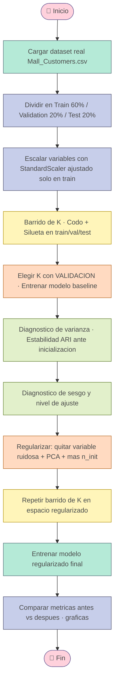

<div align="center">

# 🛍️ K-means sobre Datos Reales: Segmentación de Clientes 🛍️

### *Análisis, diagnóstico de bias/varianza y regularización de K-means con scikit-learn*


*Tecnológico de Monterrey · Módulo 2 — Inteligencia Artificial Avanzada para la Ciencia de Datos*

</div>

---

## 📋 Tabla de contenido

- [📌 Descripción general](#-descripción-general)
- [🧠 ¿Qué se hizo en este proyecto?](#-qué-se-hizo-en-este-proyecto)
- [🗂️ Estructura del repositorio](#️-estructura-del-repositorio)
- [⚙️ Instalación](#️-instalación)
- [▶️ Ejecución](#️-ejecución)
- [🔄 Flujo del análisis](#-flujo-del-análisis)
- [📊 Dataset](#-dataset)
- [✂️ División Train / Validation / Test](#️-división-train--validation--test)
- [🩺 Diagnóstico: sesgo, varianza y ajuste](#-diagnóstico-sesgo-varianza-y-ajuste)
- [🌸 Regularización aplicada](#-regularización-aplicada)
- [📈 Resultados: antes vs. después](#-resultados-antes-vs-después)
- [🖼️ Gráficas generadas](#️-gráficas-generadas)
- [🧾 Conclusiones](#-conclusiones)
- [📚 Referencias](#-referencias)
- [👩‍💻 Autora](#-autora)

---

## 📌 Descripción general


Este repositorio contiene un **análisis extendido de desempeño** del algoritmo **K-means** (scikit-learn), tomando como punto de partida el script original de [`IA-TC3009C.-K-means`](https://github.com/MichelleRergis/IA-TC3009C.-K-means) —originalmente evaluado sobre un dataset sintético (`make_blobs`)— y aplicándolo a un **dataset real de segmentación de clientes**.

El objetivo es responder una pregunta muy práctica: *¿qué tan bien generaliza K-means fuera de un dataset sintético "perfecto", y qué tanto se puede mejorar con buenas prácticas de regularización?* Para ello se incorpora una partición **train / validation / test**, un **diagnóstico explícito de sesgo, varianza y nivel de ajuste**, y una comparación **antes vs. después** de aplicar regularización y ajuste de hiperparámetros.

---

## 🧠 ¿Qué se hizo en este proyecto?

<div align="center">

| 🌷 Paso | 💬 Descripción |
|:---|:---|
| **Dataset real** | Se sustituyó `make_blobs` por el dataset real *Mall Customer Segmentation Data* (Kaggle) |
| **Train / Val / Test** | Se agregó un conjunto de **validación** independiente (antes solo había train/test) |
| **Diagnóstico de sesgo** | Se identifica en qué región de K el modelo subajusta (underfitting) |
| **Diagnóstico de varianza** | Se mide la **estabilidad** del clustering ante distintas inicializaciones (ARI) |
| **Nivel de ajuste** | Se combina sesgo + varianza para diagnosticar underfit / fit / overfit |
| **Regularización** | Selección de variables + PCA + más reinicios (`n_init`) para reducir varianza |
| **Comparación** | Métricas y gráficas **antes vs. después** de regularizar |

</div>

---

## 🗂️ Estructura del repositorio

```text
📦 kmeans-analisis-real/
 ┣ 📜 analisis_kmeans.py                          # Script principal (ejecutable desde consola)
 ┣ 📄 Mall_Customers.csv                          # Dataset real (Kaggle)
 ┣ 📄 Reporte_Kmeans_Analisis.docx                # Reporte académico completo
 ┣ 📁 resultados/                                # Carpeta generada automáticamente al ejecutar
 ┃ ┣ 🖼️ 01_metodo_codo.png
 ┃ ┣ 🖼️ 02_silueta_train_val_test.png
 ┃ ┣ 🖼️ 03_estabilidad_varianza_baseline.png
 ┃ ┣ 🖼️ 04_clusters_baseline_train_val_test.png
 ┃ ┣ 🖼️ 05_convergencia_baseline.png
 ┃ ┣ 🖼️ 06_silueta_antes_despues.png
 ┃ ┣ 🖼️ 07_clusters_regularizado_train_val_test.png
 ┃ ┣ 🖼️ 08_estabilidad_antes_despues.png
 ┃ ┣ 🖼️ 09_comparacion_antes_despues.png
 ┃ ┗ 📄 resultados.json
 ┗ 📖 README.md
```

---

## ⚙️ Instalación

<details>
<summary>💻 Ver dependencias necesarias</summary>

<br>

Instala las librerías requeridas con `pip`:

```bash
pip install numpy pandas matplotlib seaborn scikit-learn
```

</details>

| 📦 Librería | 🎯 Uso en el proyecto |
|:---|:---|
| `scikit-learn` | `train_test_split`, `StandardScaler`, `KMeans`, `PCA`, métricas (`silhouette_score`, `adjusted_rand_score`) |
| `pandas` | Carga y manejo del dataset en `DataFrame` |
| `numpy` | Operaciones numéricas y manejo de arreglos |
| `matplotlib` | Gráficas del codo, silueta, PCA, convergencia y comparativas |
| `seaborn` | Estilo visual de las gráficas |
| `json` / `pathlib` | Guardado de resultados y manejo de rutas |

---

## ▶️ Ejecución

1. Coloca `Mall_Customers.csv` en la misma carpeta que `analisis_kmeans.py`.
2. Ejecuta el script:

```bash
python analisis_kmeans.py
```

3. Revisa la carpeta `salida_real/` para ver las 9 gráficas generadas y el archivo `resultados.json` con todas las métricas numéricas.

---

## 🔄 Flujo del análisis



---

## 📊 Dataset

Se utilizó el dataset real **Mall Customer Segmentation Data** (Kaggle), con datos de 200 clientes de un centro comercial.

<div align="center">

| 🧮 Parámetro | Valor |
|:---|:---:|
| Muestras totales | 200 |
| Variables utilizadas | Age, Annual Income (k$), Spending Score (1-100), Gender (codificada) |
| Fuente | [Kaggle - Mall Customer Segmentation Data](https://www.kaggle.com/datasets/vjchoudhary7/customer-segmentation-tutorial-in-python) |
| Verdad base (ground truth) | No disponible (problema no supervisado real) |

</div>

> 💡 A diferencia del dataset sintético original, aquí **no existe una etiqueta real de grupo**, por lo que la evaluación se basa en métricas internas (silhouette, inercia) y en la **estabilidad** del clustering, no en comparación contra una verdad base.

---

## ✂️ División Train / Validation / Test

<div align="center">

| Conjunto | Muestras | Proporción | Uso |
|:---|:---:|:---:|:---|
| Entrenamiento | 120 | 60% | Ajuste de K-means y del `StandardScaler` |
| Validación | 40 | 20% | Selección de K y diagnóstico de sesgo/varianza |
| Prueba | 40 | 20% | Evaluación final e independiente |

</div>

El escalador se ajusta **únicamente con entrenamiento** y se aplica (`transform`) a validación y prueba, evitando fuga de información (*data leakage*).

---

## 🩺 Diagnóstico: sesgo, varianza y ajuste

<div align="center">

| 🌷 Diagnóstico | Modelo base (K=9, 4 variables) |
|:---|:---:|
| **Sesgo (bias)** | Bajo a medio |
| **Varianza** | Alto (ARI de estabilidad ≈ 0.62) |
| **Nivel de ajuste** | Overfit (por varianza/inestabilidad) |

</div>

El silhouette es parecido entre train/val/test (~0.38–0.41), pero el clustering **no es estable**: al cambiar solo la semilla de inicialización, más de un tercio de los clientes cambia de cluster. Esto, junto con muy pocos puntos por cluster (~13 en promedio con K=9 sobre 120 muestras), es la firma de un modelo que sobreajusta a ruido e inicialización, no a estructura real.

---

## 🌸 Regularización aplicada

Para reducir la varianza diagnosticada se aplicaron tres cambios:

- **Selección de variables:** se eliminó `Gender_num` (poco informativa, agregaba ruido/dimensionalidad).
- **PCA (2 componentes)** sobre `Annual_Income` y `Spending_Score` estandarizados, ajustado solo con entrenamiento.
- **Más reinicios (`n_init`):** de 10 a 20, para reducir la dependencia del resultado respecto a la inicialización.

---

## 📈 Resultados: antes vs. después

<div align="center">

| 🌷 Métrica | Antes (K=9, 4 var.) | Después (K=5, PCA 2D) |
|:---|:---:|:---:|
| Silhouette (entrenamiento) | 0.405 | **0.557** |
| Silhouette (validación) | 0.381 | **0.547** |
| Silhouette (prueba) | 0.410 | **0.537** |
| Inercia (WCSS) entrenamiento | 101.12 | **37.88** |
| Estabilidad (ARI promedio entre 15 corridas) | 0.623 | **0.893** |

</div>

🌟 **Hallazgo clave:** eliminar una variable ruidosa, reducir la dimensionalidad y aumentar `n_init` no solo mejora el silhouette (~+37%) en los tres conjuntos, sino que **casi duplica la estabilidad** del clustering (ARI 0.62 → 0.89), pasando de un modelo con sobreajuste por varianza a uno bien ajustado (*fit*).

---

## 🖼️ Gráficas generadas

Al ejecutar el script, se generan automáticamente las siguientes visualizaciones dentro de `salida_real/`:

| Archivo | Contenido |
|:---|:---|
| `01_metodo_codo.png` | Curva de inercia (WCSS) vs. K en entrenamiento |
| `02_silueta_train_val_test.png` | Silhouette vs. K en train/val/test (diagnóstico de sesgo/ajuste) |
| `03_estabilidad_varianza_baseline.png` | Estabilidad (ARI) vs. K ante distintas inicializaciones (diagnóstico de varianza) |
| `04_clusters_baseline_train_val_test.png` | Proyección PCA 2D de los clusters del modelo base |
| `05_convergencia_baseline.png` | Inercia por iteración (curva de convergencia) |
| `06_silueta_antes_despues.png` | Silhouette vs. K, antes y después de regularizar |
| `07_clusters_regularizado_train_val_test.png` | Proyección PCA 2D de los clusters del modelo regularizado |
| `08_estabilidad_antes_despues.png` | Estabilidad (ARI) vs. K, antes y después de regularizar |
| `09_comparacion_antes_despues.png` | Comparación de barras: todas las métricas antes vs. después |

---

## 🧾 Conclusiones

- El desempeño de K-means sobre datos reales **no depende solo de elegir un buen K**: la relevancia de las variables y la estabilidad de la solución son igual de importantes.
- El modelo base parecía generalizar bien (silhouette similar en train/val/test), pero un diagnóstico de **varianza vía estabilidad ante inicialización (ARI)** reveló un sobreajuste que las métricas de silhouette por sí solas no mostraban.
- La **regularización** (selección de variables + PCA + más `n_init`) mejoró simultáneamente la calidad (silhouette) y la reproducibilidad (ARI) del clustering, confirmando que estas técnicas, típicamente asociadas a modelos supervisados, también aportan valor en un algoritmo no supervisado como K-means.

📄 Para el análisis completo, metodología detallada, diagnóstico paso a paso y todas las figuras, consulta el reporte: **[`Reporte_Kmeans_Analisis.docx`](./Reporte_Kmeans_Analisis.docx)**

---

## 📚 Referencias

- Dataset: Choudhary, V. (Kaggle) — *Customer Segmentation Tutorial in Python / Mall Customer Segmentation Data*. https://www.kaggle.com/datasets/vjchoudhary7/customer-segmentation-tutorial-in-python
- Código base: Rergis Novelo, M. — *IA-TC3009C. K-means*. https://github.com/MichelleRergis/IA-TC3009C.-K-means
- Pedregosa, F. et al. (2011). Scikit-learn: Machine Learning in Python. *Journal of Machine Learning Research*, 12, 2825-2830.
- Russell, S. & Norvig, P. (2010). *Artificial Intelligence: A Modern Approach* (3ra ed.). Prentice Hall.

---

## 👩‍💻 Autora

<div align="center">

**Michelle Rergis Novelo** · A01798576
Tecnológico de Monterrey — TC3006C
Módulo 2: Inteligencia Artificial Avanzada para la Ciencia de Datos
Profesor: Jorge Adolfo Ramírez Uresti


</div>
